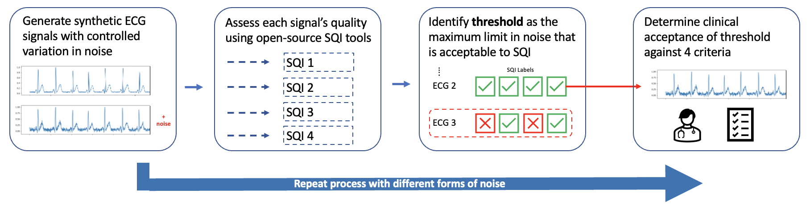

# Assessing Signal Quality Index algorithms with synthetic ECG data
Comparison of exisiting open-source SQI tools by incrementally increasing noise of ECG signals using a synthetic ECG generator. 
Code for project: Assessment of ECG signal quality index algorithms using synthetic ECG data. This project is assessing the robustness of several open-source Signal Quality Index Tools. This project uses a synthetic ECG generator to generate ECG signals that increase in variation through gradual changes in a variable, available at: https://github.com/UTU-Health-Research/framework_for_synthetic_biosignals. These signals are then passed through 4 SQI tools that are being assessed in the current project. Figure below shows the pipeline for generating data and assessing quality (figure 1 from paper):

This project was completed through google colab for ease of use for Tensorflow package. See the file 'installations.ipynb' to see how the 4 SQI tools were installed and any changes that were made to ensure they ran as expected in the respository are noted. The Orphanido SQI tool is contained within the repository, taken from: https://github.com/peterhcharlton/bsp-boo whilst the Zhao & Zhang tool was used with Neurokit implementation. 

To see the code for how each variable was independtly changed, see the notebooks in the 'tests' folder. Producing variation of each independant variable when generating the ECG signals varied between forms of noise so a seperate notebook was run for each. In each of the notebooks, any necessary packages are initally installed. A loop is then initiated which starts at 0 and adds variation to signal incrementally (set by the increment variable). At each incremental increase in the independent, 100 signals with small amounts of random variation in other variables are created to maintain a realistic ECG. Each of the 100 ECG signals are assessed using the 4 SQI tools and the chance of the signal being classified as acceptable is calculated (number of signals passed/100). At each increment this is performed until all of the SQI tools consistently return a response of unnaceptable (where possible).
